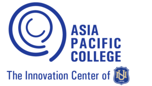

== Company Profile

[cols=2*]
|===
s|Registered Name:
|Asia Pacific College

s|Company Logo:
a|

ifdef::backend-docbook5[]

endif::backend-docbook5[]
ifndef::backend-docbook5[]
image::https://raw.githubusercontent.com/cgvillarroel/projman-documents/main/images/apc_logo.png[]
endif::backend-docbook5[]

s|Address:
|3 Humabon Place, Magallanes, Makati City, 1232

s|Line of Business:
|Private College Institution

s|Type of Customers:
|Students

s|Client:
|Manuel Sebastian Sanchez
|===

Asia Pacific College (APC) is a private college in Makati, Philippines that offers programs related to information technology, computing, arts, business management, engineering, and architecture. Its tagline embodies one of its core values: “Real Projects. Real Learning.” It teaches its students practical skills by having them work on real-world projects in project-based learning (PBL) courses.

The vision, mission, and values of APC are as follows:

Vision.:: Asia Pacific College envisions itself to be the preferred Higher Education Institution bridging academe and industry with its programs founded on the concepts and applications of IT, guided by the core values of integrity, industry and innovation that works.
Mission.:: Asia Pacific College, powered by education and industry professionals as faculty and a balanced curriculum, aims to provide business and the information and communications technology industry in the Philippines and in the global community lifelong learning graduates who are anchored on the principles of integrity and professionalism.
Values.:: APC aims to produce graduates with strong sense of industry or hard work, integrity or being honest and having strong moral / ethical principles, and innovation or constantly introducing new and creative methods or ideas.

=== Project: PubRAMS: A Project Document Publishing System

PubRAMS is a solution made for Asia Pacific College (APC) that aims to address the tedious and potentially confusing process of publishing student project documents to the school's library. This process involves the exchange of documents across multiple channels among staff from different offices. Associated processes also involve tedious encoding of numerous projects details for recording, publishing, and analyzing purposes. This solution aims to consolidate all these processes onto a single platform, automating processes and providing tools to simplify interactions.
