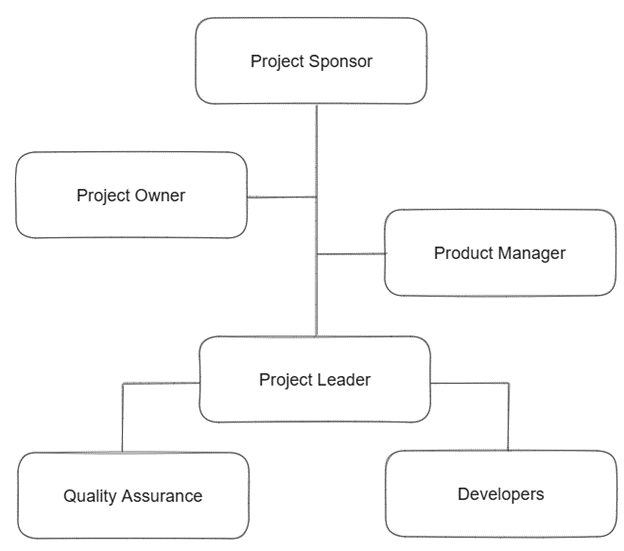

== Human Resources

=== Introduction

Effective human resource management is crucial for project success. It ensures that projects are staffed with the right individuals and managed professionally to deliver results on time. Clearly defining roles, duties, and performance metrics is vital for creating an efficient and effective project strategy.

Our project team will be managed through this comprehensive plan, which will clearly define each team member's roles and responsibilities. Prioritizing communication will ensure optimal productivity. By outlining roles, decision-making authority, responsibilities, and required skills, this plan clarifies the key tasks for each project team member, ensuring everyone understands their contributions to the project's success.

=== Roles and Responsibilities

SemiByte will ensure effective implementation of the Human Resource Plan by clearly defining and assigning roles and responsibilities.

[%header,cols=4*]
|===
|Role
|Authority
|Responsibility
|Competency

|Project Sponsor (Manuel Sebastian S. Sanchez)
|Holds ultimate decision-making authority for the project.
|Defines the project scope, goals, and objectives. Reviews and approves project deliverables and changes.
|Demonstrates strong leadership qualities, strategic thinking, and effective stakeholder communication skills.

|Product Owner (Manuel Sebastian S. Sanchez)
|Approves the project's business case and budget, provides strategic direction and resources, and makes decisions on ideas pitched by the team, either approving or rejecting them as necessary.
|Responsible for making strategic decisions, collaborating closely with the development team, and ensuring the attainment of business objectives.
|Demonstrates strong leadership and strategic thinking skills. Communicates effectively, particularly in team meetings, and consistently maintains a professional demeanor throughout the project.

|Project Manager (Jojo F. Castillo)
|Holds authority within the project boundaries.
|The Project Manager is tasked with overseeing the project's scope, ensuring it stays within predefined boundaries, while also being responsible for executing and delivering the project.
|Demonstrates strong project management, leadership, and communication skills.

|Project Leader (Chase Villarroel)
|Facilitates the team's processes, ensuring adherence to agile principles.
|Guides and monitors the team's progress, ensuring adherence to the Scrum framework. Works closely with the Project Manager to ensure the project progresses within scope.
|Must possess a thorough understanding of Agile principles and Scrum practices, including proficiency in Scrum artifacts, ceremonies, and roles.

|Project Team
|Each team member may have varying levels of authority depending on their position and expertise.
|The Project Team is accountable for creating project deliverables and collaborating with other team members to ensure project success. This involves comprehending and following the project's scope, identifying any risks or issues related to scope, and effectively communicating these matters to the Project Manager and Project Leader.
|The competency of a project team encompasses a blend of technical skills, problem-solving abilities, and effective communication necessary for successful project execution.

|Developers
|Authority to identify and address technical issues, bugs, and challenges that arise during the development process.
|Work with business analysts, designers, and testers to ensure effective coordination and successful delivery of project tasks.
|Proficiency in relevant programming languages, software development expertise, and strong problem-solving skills.

|Quality Assurance
|Enforces adherence to quality standards, processes, and methodologies
|Testers perform various types of testing, including functional testing, integration testing, performance testing, and user acceptance testing, to ensure the software meets quality standards.
|Able to collaborate effectively with development teams, stakeholders, and other team members, prioritize clear communication and collaboration skills.
|===

=== Project Organizational Charts

An organizational chart for PubRAMS provides a visual representation of the project team's structure and the reporting relationships within the project. This chart clearly outlines the hierarchy, roles, and responsibilities of each team member, ensuring efficient communication and coordination. It helps in understanding the flow of information and authority, facilitating better management and execution of project activities. At the top of the organizational chart, the Product Sponsor provides resources and support for the project and is responsible for making major decisions. This role ensures that the project aligns with the organization's strategic goals and has the necessary backing to succeed. Directly under the Project Sponsor is the Project Manager, who oversees the project from the planning phase through to the closing phase. The Project Manager is responsible for ensuring that the project stays on track, meets its objectives, and is completed on time and within budget. Directly under the Project Manager Is the Project Leader as they facilitate the agile methodology among the team, removes any obstacles, and ensures the team adheres to its agreed processes.

ifdef::backend-docbook5[]

endif::backend-docbook5[]
ifndef::backend-docbook5[]
image:https://raw.githubusercontent.com/cgvillarroel/projman-documents/main/images/org.png[Organizational Chart]
endif::backend-docbook5[]

=== Staffing Management

The Staffing Management Plan for PubRAMS will be thoroughly reviewed and monitored as it is critical to the project's successful deployment. It encompasses the strategies and procedures the team will employ to acquire, manage, and release personnel throughout the project lifecycle.

* The project sponsor will ensure the acquisition of necessary personnel for the project, ensuring roles are filled with requisite skills and responsibilities. The majority of the workforce responsible for managing and maintaining the web application will be sourced internally.
* Training programs will be implemented to address identified skill gaps among team members, ensuring they have the necessary knowledge and capabilities to perform effectively in their roles.
* Regular performance reviews will be conducted and closely monitored to evaluate each team member's contributions to the project. These reviews serve as a mechanism to ensure alignment with project requirements and goals.

The project's Human Resource and Staffing plan may undergo changes to accommodate contingencies and updates as the project progresses. Updates to the staffing management will ensure the fulfillment of necessary roles and responsibilities to successfully complete the project.

[%header,cols=5*]
|===
|Role
|Project Responsibility
|Skills Required
|Performance Review
|Recognition and Rewards

|Project Manager
|The Project Manager is tasked with overseeing the project's scope, ensuring it stays within predefined boundaries, while also being responsible for executing and delivering the project.
|Strong project management, leadership, and communication skills.
|Regularly review performance, offer constructive feedback, and resolve any issues promptly.
|The project manager will establish a recognition and rewards system to motivate team members and foster high performance.

|Project Leader
|Guides and monitors the team's progress, ensuring adherence to the Scrum framework. Works closely with the Project Manager to ensure the project progresses within scope.
|Strong leadership Team management abilities Excellent communication Time management skills.
|Regularly conduct performance reviews to assess team members' progress and achievements. Provide constructive feedback and set performance goals aligned with the project's objectives.
|Recognize their exceptional leadership, successful project delivery, and their ability to inspire and motivate team members, leading to positive project outcomes.

|Project Team
|Actively participate in project activities, collaborate with team members, and deliver assigned tasks and deliverables on time.
|Possess effective collaboration and communication skills, the ability to work well in a team environment, and a strong commitment to meeting project objectives and deadlines. Additionally, have skills in web development, database management, and other relevant technical areas.
|Evaluate each team member's contributions based on their adherence to deadlines, quality of work, teamwork skills, and ability to meet project objectives.
|The project leader or manager will institute a system for recognition and rewards to motivate team members and foster high performance.

|Developers
|Work with business analysts, designers, and testers to ensure effective coordination and successful delivery of project tasks.
|Proficiency in Programming Languages, Problem-Solving Skills, Effective Communication, Teamwork, Time Management, Analytical Thinking
|Reviews will encompass comprehensive code testing, progress assessment against timelines and documentation, and review of any revisions made since the last review cycle.
|The project leader or manager will institute a system for recognition and rewards to motivate team members and foster high performance.

|Quality Assurance
|Testers perform various types of testing, including functional testing, integration testing, performance testing, and user acceptance testing, to ensure the software meets quality standards.
|Skills in Testing Methodologies, Critical Thinking, Effective Communication, Ability to Collaborate with those involved
|The timing and structure of performance reviews will be decided according to the project's requirements and the policies established by the company.
|The project leader or manager will institute a system for recognition and rewards to motivate team members and foster high performance.
|===
