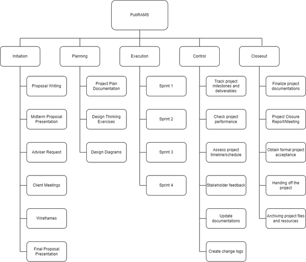

== Work Breakdown Structure

=== Introduction

The Work Breakdown Structure (WBS) is a fundamental project management tool that delineates the project's scope into manageable sections, enabling efficient planning, execution, and control. This document presents the WBS for PubRAMS, designed to provide a structured and hierarchical decomposition of the project deliverables and tasks. By breaking down the project into smaller, more manageable components, the WBS facilitates clear definition of work packages, assignment of responsibilities, and tracking of progress.

The Work Breakdown Structure presented here represents all the work required to complete this project.

=== Outline View

The outline view presents an easy to view and understand layout for the WBS.

* 0. PubRAMS
* 1. Initiation
** 1.1. Proposal Writing
** 1.2. Midterm Proposal Presentation
** 1.3. Adviser Request
** 1.4. Client Meetings
*** 1.4.1. Meeting with Sir Sean
*** 1.4.2. Meeting with Ms. Rhea (Executive Director)
*** 1.4.3. Meeting with Ms. Wednesday (Program Director)
** 1.5. Wireframes (Low-fidelity)
** 1.6. Final Proposal Presentation
* 2. Planning
** 2.1. Project Plan Documentation
*** 2.1.1. Business Case
*** 2.1.2. Stakeholder Management Strategy
*** 2.1.3. Stakeholder Analysis
*** 2.1.4. Project Charter
*** 2.1.5. Scope Management Plan
*** 2.1.6. Cost Management Plan
*** 2.1.7. Time Management Plan
*** 2.1.8. Work Breakdown Structure
*** 2.1.9. Human Resource Management Plan
*** 2.1.10. Change Management Plan
*** 2.1.11. Communication Management Plan
*** 2.1.12. Quality Management Plan
*** 2.1.13. Risk Management Plan
*** 2.1.14. Procurement Management Plan
*** 2.1.15. Implementation/Transition Plan
** 2.2. Design Thinking Exercises
*** 2.2.1. Empathy Map
*** 2.2.2. As-Is Scenario Map
*** 2.2.3. Needs Statement
*** 2.2.4. User Stories
** 2.3. Design Diagrams
*** 2.3.1. Use Case Diagram
*** 2.3.2. Context Diagram
*** 2.3.3. Data Flow Diagram
*** 2.3.4. Entity-Relationship Diagram
*** 2.3.5. Activity Diagram
*** 2.3.6. Sequence Diagram
*** 2.3.7. State Diagram
*** 2.3.8. Deployment Diagram
* 3. Execution
** 3.1. Sprint 1
*** 3.1.1. MS Entra ID Login
*** 3.1.2. Assigning user roles
*** 3.1.3. Submit project
*** 3.1.4. Status check
**** 3.1.4.1. Student to instructor
**** 3.1.4.2. Instructor to XD
** 3.2. Sprint 2
*** 3.2.1. Manage groups
**** 3.2.1.1. Create groups
**** 3.2.1.2. Edit groups
***** 3.2.1.2.1.  Add member
***** 3.2.1.2.2. Remove member
***** 3.2.1.2.3. Change leader
**** 3.2.1.3. Delete groups
*** 3.2.2. Status check
**** 3.2.2.1. XD to EC Head
**** 3.2.2.2. EC Head to Proofreader
*** 3.2.3. EC Head assign paper to proofreader
** 3.3. Sprint 3
*** 3.3.1. Status check
**** 3.3.1.1. Proofreader to student
**** 3.3.1.2. Student to instructor
**** 3.3.1.3. Instructor to librarian
*** 3.3.2. File uploading and management
*** 3.3.3. Koha setup
** 3.4. Sprint 4
*** 3.4.1. Download reports
*** 3.4.2. Upload bibliography to Koha
*** 3.4.3. Host in Microsoft Azure
* 4. Control
** 4.1. Track project milestones and deliverables
** 4.2. Check project performance
** 4.3. Assess project timeline/schedule
** 4.4. Stakeholder feedback
** 4.5. Update documentations
** 4.6. Create change logs
* 5. Closeout
** 5.1. Finalize project documentations
** 5.2. Project Closure Report/Meeting
** 5.3. Obtain formal project acceptance
** 5.4. Handing off the project
** 5.5. Archiving project files and resources

=== Hierarchical Structure

The hierarchal structure is similar to the outline view but without indentation.

[%header,cols=3*]
|===
|Level
|WBS Code
|Element Name

|0
|0
|PubRAMS

|1
|1
|Initiation

|2
|1.1
|Proposal Writing

|2
|1.2
|Midterm Proposal Presentation

|2
|1.3
|Adviser Request

|2
|1.4
|Client Meetings

|3
|1.4.1
|Meeting with Sir Sean

|3
|1.4.2
|Meeting with Ms. Rhea (Executive Director)

|3
|1.4.3
|Meeting with Ms. Wednesday

|2
|1.5
|Wireframes (Low-fidelity)

|2
|1.6
|Final Proposal Presentation

|1
|2
|Planning

|2
|2.1
|Project Plan Documentation

|3
|2.1.1
|Business Case

|3
|2.1.2
|Stakeholder Management Strategy

|3
|2.1.3
|Stakeholder Analysis

|3
|2.1.4
|Project Charter

|3
|2.1.5
|Scope Management Plan

|3
|2.1.6
|Cost Management Plan

|3
|2.1.7
|Time Management Plan

|3
|2.1.8
|Work Breakdown Structure

|3
|2.1.9
|Human Resource Management Plan

|3
|2.1.10
|Change Management Plan

|3
|2.1.11
|Communication Management Plan

|3
|2.1.12
|Quality Management Plan

|3
|2.1.13
|Risk Management Plan

|3
|2.1.14
|Procurement Management Plan

|3
|2.1.15
|Implementation/Transition Plan

|2
|2.2
|Design Thinking Exercises

|3
|2.2.1
|Empathy Map

|3
|2.2.2
|As-Is Scenario Map

|3
|2.2.3
|Needs Statement

|3
|2.2.4
|User Stories

|2
|2.3
|Design Diagrams

|3
|2.3.1
|Use Case Diagram

|3
|2.3.2
|Context Diagram

|3
|2.3.3
|Data Flow Diagram

|3
|2.3.4
|Entity-Relationship Diagram

|3
|2.3.5
|Activity Diagram

|3
|2.3.6
|Sequence Diagram

|3
|2.3.7
|State Diagram

|3
|2.3.8
|Deployment Diagram

|1
|3
|Execution

|2
|3.1
|Sprint 1

|3
|3.1.1
|MS Entra ID Login

|3
|3.1.2
|Assigning user roles

|3
|3.1.3
|Submit project

|3
|3.1.4
|Status check

|4
|3.1.4.1
|Student to instructor

|4
|3.1.4.2
|Instructor to XD

|2
|3.2
|Sprint 2

|3
|3.2.1
|Manage groups

|4
|3.2.1.1
|Create groups

|4
|3.2.1.2
|Edit groups

|5
|3.2.1.2.1
|Add member

|5
|3.2.1.2.2
|Remove member

|5
|3.2.1.2.3
|Change leader

|4
|3.2.1.3
|Delete groups

|3
|3.2.2
|Status check

|4
|3.2.2.1
|XD to EC Head

|4
|3.2.2.2
|EC Head to Proofreader

|3
|3.2.3
|EC Head assign paper to proofreader

|2
|3.3
|Sprint 3

|3
|3.3.1
|Status check

|4
|3.3.1.1
|Proofreader to student

|4
|3.3.1.2
|Student to instructor

|4
|3.3.1.3
|Instructor to librarian

|3
|3.3.2
|File uploading and management

|3
|3.3.3
|Koha setup

|2
|3.4
|Sprint 4

|3
|3.4.1
|Download reports

|3
|3.4.2
|Upload bibliography to Koha

|3
|3.4.3
|Host in Microsoft Azure

|1
|4
|Control

|2
|4.1
|Track project milestones and deliverables

|2
|4.2
|Check project performance

|2
|4.3
|Assess project timeline/schedule

|2
|4.4
|Stakeholder feedback

|2
|4.5
|Update documentations

|2
|4.6
|Create change logs

|1
|5
|Closeout

|2
|5.1
|Finalize project documentations

|2
|5.2
|Project Closure Report/Meeting

|2
|5.3
|Obtain formal project acceptance

|2
|5.4
|Handing off the project

|2
|5.5
|Archiving project files and resources
|===

=== Tree Structure View

ifdef::backend-docbook5[]

endif::backend-docbook5[]
ifndef::backend-docbook5[]
image:https://raw.githubusercontent.com/cgvillarroel/projman-documents/main/images/wbs_tree.png[WBS Tree Structure View]
endif::backend-docbook5[]

=== WBS Dictionary

The WBS Dictionary contains all the details of the WBS which are necessary to successfully complete the project. It contains a definition of each Work Package which can be thought of as a mini scope statement.

[%header,cols=4*]
|===
|Level
|WBS Code
|Element Name
|Definition

|0
|0
|PubRAMS
|All work necessary to complete the new publishing system for Asia Pacific College

|1
|1
|Initiation
|All work associated to initiate the project.

|2
|1.1
|Proposal Writing
|A proposal was written for this project, with the whole team’s contribution.

|2
|1.2
|Midterm Proposal Presentation
|The project was presented to a set of panelists/

|2
|1.3
|Adviser Request
|An adviser was requested to assist with the proposal, planning, and development of the new project.

|2
|1.4
|Client Meetings
.4+|Meetings conducted with the potential clients

|3
|1.4.1
|Meeting with Sir Sean

|3
|1.4.2
|Meeting with Ms. Rhea (Executive Director)

|3
|1.4.3
|Meeting with Ms. Wednesday (Program Director)

|2
|1.5
|Wireframes (Low-fidelity)
|Wireframes were created to show the team’s vision for the project

|2
|1.6
|Final Proposal Presentation
|A complete proposal was presented to a set of panelists for complete approval

|1
|2
|Planning
|All process associated with developing the plan for the project

|2
|2.1
|Project Plan Documentation
|Consists of all documentations needed for the development and production of this project

|3
|2.1.1
|Business Case
|A documented justification for a project, detailing its benefits, costs, risks, and opportunities to inform stakeholders' decision-making.

|3
|2.1.2
|Stakeholder Management Strategy
|A plan for identifying, engaging, and communicating with project stakeholders to ensure their needs and expectations are met and to foster their support and involvement.

|3
|2.1.3
|Stakeholder Analysis
|The process of identifying and assessing the interests, influence, and impact of individuals or groups involved in or affected by a project to inform effective engagement strategies.

|3
|2.1.4
|Project Charter
|A formal document that authorizes a project, outlining its objectives, scope, stakeholders, and roles and responsibilities, and serving as a reference for project planning and execution.

|3
|2.1.5
|Scope Management Plan
|A document that outlines how the project scope will be defined, validated, and controlled to ensure all project requirements are met and to manage scope changes effectively.

|3
|2.1.6
|Cost Management Plan
|A document that details the procedures and criteria for planning, estimating, budgeting, and controlling project costs to ensure the project is completed within the approved budget.

|3
|2.1.7
|Time Management Plan
|A document that outlines the processes and procedures for planning, scheduling, and controlling project timelines to ensure timely completion of project deliverables.

|3
|2.1.8
|Work Breakdown Structure
|A hierarchical decomposition of a project into smaller, more manageable components, detailing all the work required to achieve the project objectives.

|3
|2.1.9
|Human Resource Management Plan
|A document that outlines how human resources will be acquired, developed, managed, and released throughout the project to ensure the right personnel with the necessary skills are available to achieve project objectives.

|3
|2.1.10
|Change Management Plan
|A structured approach that outlines how changes to project scope, schedule, and resources will be identified, assessed, approved, implemented, and monitored to minimize disruptions and ensure project success.

|3
|2.1.11
|Communication Management Plan
|A document that outlines how project information will be distributed, stored, retrieved, and managed among stakeholders to ensure timely and appropriate communication throughout the project lifecycle.

|3
|2.1.12
|Quality Management Plan
|A comprehensive document detailing the processes, standards, and methodologies that will be used to ensure that project deliverables meet the specified quality requirements and satisfy stakeholder expectations.

|3
|2.1.13
|Risk Management Plan
|Outlines how risks will be identified, assessed, managed, and monitored throughout a project.

|3
|2.1.14
|Procurement Management Plan
|Outlines how procurement processes will be managed throughout a project

|3
|2.1.15
|Implementation/Transition Plan
|Outlines the steps and activities necessary to successfully implement a new system, process, or change within an organization.

|2
|2.2
|Design Thinking Exercises
|All work involved in the design thinking phase of the project

|3
|2.2.1
|Empathy Map
|A tool used to understand and empathize with users or stakeholders by visualizing their thoughts, feelings, actions, and motivations.

|3
|2.2.2
|As-Is Scenario Map
|Illustrates how things currently work, including activities, interactions, and dependencies between different components or entities.

|3
|2.2.3
|Needs Statement
|Articulates the problem or opportunity that a project aims to address. It defines the gap between the current state and the desired future state, outlining the essential requirements and objectives necessary to meet the stakeholders' needs.

|3
|2.2.4
|User Stories
|Brief, simple descriptions of a feature or functionality from the perspective of the end-user or customer.

|2
|2.3
|Design Diagrams
|All diagrams created for the development of the project.

|3
|2.3.1
|Use Case Diagram
|Illustrates the interactions between users (actors) and the system, outlining the various use cases (functionalities) the system provides and how actors engage with these use cases.

|3
|2.3.2
|Context Diagram
|Provides a high-level view of a system, illustrating its boundaries, external entities that interact with it, and the major data flows between the system and these entities.

|3
|2.3.3
|Data Flow Diagram
|Illustrates the flow of data within a system, showing how data is processed, stored, and communicated between different processes and data stores.

|3
|2.3.4
|Entity-Relationship Diagram
|Illustrates the data structure of a system, showing entities, their attributes, and the relationships between them.

|3
|2.3.5
|Activity Diagram
|Illustrates the workflow of activities and actions in a system, showing the sequence of steps and the flow of control from one activity to the next

|3
|2.3.6
|Sequence Diagram
|Illustrates the interactions between objects in a specific sequence, highlighting the order of messages exchanged to achieve a particular functionality in a system.

|3
|2.3.7
|State Diagram
|Illustrates the states and transitions of an object or system, detailing how it responds to events and changes from one state to another over time.

|3
|2.3.8
|Deployment Diagram
|Illustrates the physical arrangement of hardware and software in a system, showing how software components are distributed across various nodes and how they communicate with each other.

|1
|3
|Execution
|Work involved to execute the project.

|2
|3.1
|Sprint 1
|All work done in Sprint 1

|3
|3.1.1
|MS Entra ID Login
|Integration: MS Entra ID in the project’s login system

|3
|3.1.2
|Assigning user roles
|Feature: Admin assigning roles for new users

|3
|3.1.3
|Submit project
|Feature: Students can add their projects for submission

|3
|3.1.4
|Status check
|Feature: Users can see who in the process of submission has the project

|4
|3.1.4.1
|Student to instructor
|Feature: Submission from student to instructor

|4
|3.1.4.2
|Instructor to XD
|Feature: Passing documents from instructor to XD

|2
|3.2
|Sprint 2
|All work done in Sprint 2

|3
|3.2.1
|Manage groups
|Feature: Managing PBL groups by the PBL instructors

|4
|3.2.1.1
|Create groups
|Feature: Create a group for a specific project

|4
|3.2.1.2
|Edit groups
|Feature: Edit the created group

|5
|3.2.1.2.1
|Add member
|Feature: Add a member from the group

|5
|3.2.1.2.2
|Remove member
|Feature: Remove a member from the group

|5
|3.2.1.2.3
|Change leader
|Feature: Change the leader of the group

|4
|3.2.1.3
|Delete groups
|Feature: Delete groups that are created by mistake

|3
|3.2.2
|Status check
|Feature: Users can see who in the process of submission has the project

|4
|3.2.2.1
|XD to EC Head
|Feature: Passing documents from XD to EC Head

|4
|3.2.2.2
|EC Head to Proofreader
|Feature: Passing documents from EC Head to Proofreader

|3
|3.2.3
|EC Head assign paper to proofreader
|Feature: EC Head can assign paper to a specific proofreader for distribution of load

|2
|3.3
|Sprint 3
|All work done in Sprint 3.

|3
|3.3.1
|Status check
|Feature: Users can see who in the process of submission has the project

|4
|3.3.1.1
|Proofreader to student
|Feature: Proofreader returns the document to the student

|4
|3.3.1.2
|Student to instructor
|Feature: Student submits the proofread document to the instructor for checking

|4
|3.3.1.3
|Instructor to librarian
|Feature: Instructor sends the documents along with the complete project details to the librarian for cataloging and archiving

|3
|3.3.2
|File uploading and management
|Feature: File management within the system

|3
|3.3.3
|Koha setup
|Feature: Setting up a dummy Koha system

|2
|3.4
|Sprint 4
|All work done in Sprint 4

|3
|3.4.1
|Download reports
|Feature: Download reports on all submitted projects in the system

|3
|3.4.2
|Upload bibliography to Koha
|Feature: Ability to upload the bibliography to the dummy Koha system

|3
|3.4.3
|Host in Microsoft Azure
|Host the web app in Microsoft Azure

|1
|4
|Control
|All the work involved in the control process of the project.

|2
|4.1
|Track project milestones and deliverables
|See if all project deliverables made were on track with the expected deliverables

|2
|4.2
|Check project performance
|Assess the project’s performance

|2
|4.3
|Assess project timeline/schedule
|Track if project deliverables were made within the project timeline/schedule

|2
|4.4
|Stakeholder feedback
|Gather feedback from the stakeholder

|2
|4.5
|Update documentations
|Update the documentations according to changes made during the development

|2
|4.6
|Create change logs
|Record all major changes of the project

|1
|5
|Closeout
|Work associated with closing the project.

|2
|5.1
|Finalize project documentations
|Finalize all changes in the project documentations

|2
|5.2
|Project Closure Report/Meeting
|Conduct a meeting for the retrospective, report, and evaluation of the project

|2
|5.3
|Obtain formal project acceptance
|Obtain formal project acceptance from all principals involved

|2
|5.4
|Handing off the project
|Hand off the project to a different team who will maintain the system

|2
|5.5
|Archiving project files and resources
|Archive important project files and resources for future reference
|===

=== Glossary of Terms

The Glossary of Terms will serve as a guide on terms mentioned within this document.

WBS Code.:: A unique identifier assigned to each element in a Work Breakdown Structure for the purpose of designating the element's hierarchical location within the WBS.
Work Package.:: A Work Package is a deliverable or work component at the lowest level of its WBS branch.
WBS Component.:: A component of a WBS which is located at any level.  It can be a Work Package or a WBS Element as there's no restriction on what a WBS Component is.
WBS Element.:: A WBS Element is a single WBS component, and its associated attributes located anywhere within a WBS.  A WBS Element can contain work, or it can contain other WBS Elements or Work Packages.
